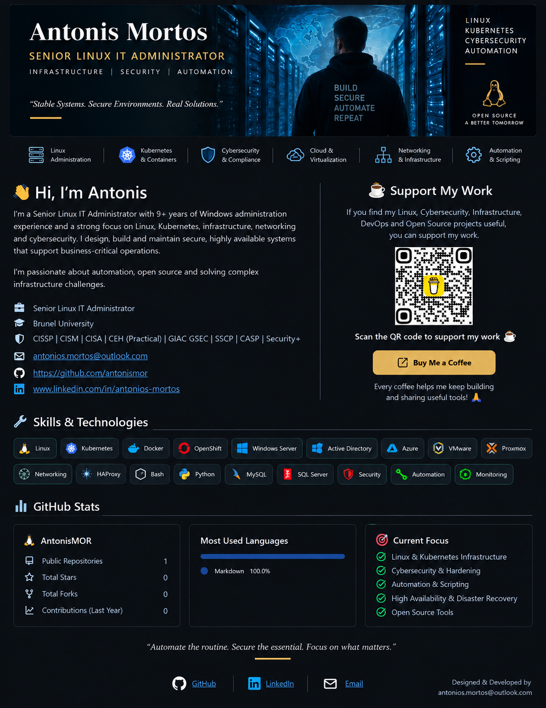

  

  <a href="https://github.com/antonismor">GitHub</a>
  &nbsp; • &nbsp;
  <a href="https://www.linkedin.com/in/antonios-mortos">LinkedIn</a>
  &nbsp; • &nbsp;
  <a href="mailto:antonios.mortos@outlook.com">Email</a>

 

<h2 align="center">☕ Support My Work</h2>

If you find my Linux, Cybersecurity, Infrastructure, DevOps and Open Source projects useful,
you can support my work.

  

  <b>Scan the QR code to support my work ☕</b>

